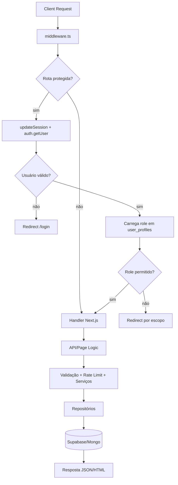
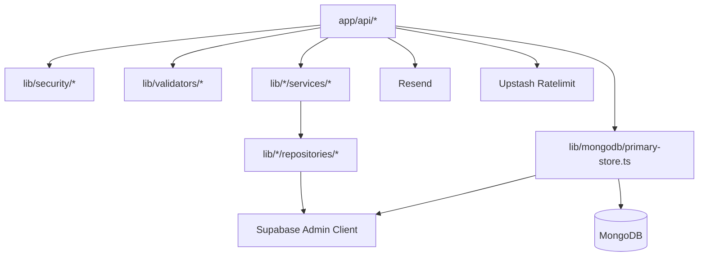

# Documentação Oficial de Engenharia — novavix-site

## 1. Visão geral do sistema
`novavix-site` é uma aplicação Next.js 14 (App Router) orientada a operações de SST com ênfase em coleta estruturada de dados psicossociais (COPSOQ), gestão de formulários dinâmicos, importação de colaboradores, analytics técnico e trilha de auditoria.

O sistema combina:
- camada web (páginas e APIs internas via `app/api/*`)
- autenticação e sessão via Supabase Auth
- persistência transacional principal no Supabase/Postgres
- camada MongoDB usada para leitura `mongo-first`, cache operacional e espelhamento
- integrações de e-mail, rate limit distribuído e CMS administrativo

Problemas que resolve:
- padronizar coleta COPSOQ por colaborador
- gerar visão agregada por empresa/setor/GHE com confidencialidade
- habilitar ingestão de dados de colaboradores via arquivos operacionais (`txt`, `csv`, `xlsx`)
- distribuir formulários por link único e por lote
- disponibilizar dashboards técnicos e empresariais com filtros temporais e organizacionais

Perfis principais encontrados no código:
- `admin`
- `empresa`
- `clinica`
- `tecnico` (fortemente usado em guards e SQL; ver observação de consistência na seção de riscos)
- `integration` (contexto derivado de API key em rotas técnicas)

---

## 2. Arquitetura do sistema
### 2.1 Padrão arquitetural observado
A aplicação usa um padrão modular em camadas:
- Camada de entrada HTTP/UI:
- páginas em `app/*`
- rotas API em `app/api/*`
- middleware global em `middleware.ts`
- Camada de aplicação/domínio:
- serviços em `lib/*/services/*`
- regras de scoring/classificação em `lib/copsoq/scoring/*`
- lógica de parsing/form runtime em `lib/forms/*` e `lib/imports/*`
- Camada de validação:
- validadores explícitos em `lib/validators/*`
- Camada de acesso a dados:
- repositórios Supabase (ex.: `lib/copsoq/repositories/*`, `lib/imports/repositories/*`, `lib/analytics/repositories/*`)
- store Mongo-first e mirror em `lib/mongodb/*`
- Camada de infraestrutura:
- clientes Supabase (`lib/supabase/*`)
- cliente Mongo (`lib/mongodb/client.ts`)
- e-mail (`lib/email/send-form-invite.ts`)
- rate limit/CORS/headers (`lib/security/*`)

### 2.2 Separação de responsabilidades
- `app/api/*`: orquestração HTTP, auth/contexto, validação, chamadas de serviço, tratamento de erro e shape de resposta.
- `lib/validators/*`: contrato de entrada (payload/query), evitando espalhamento de validação.
- `lib/*/services/*`: regras de negócio e fluxo transacional do caso de uso.
- `lib/*/repositories/*`: operações de leitura/escrita em banco.
- `lib/mongodb/primary-store.ts`: abstrações mongo-first e fallback para Supabase + upsert em cache.

### 2.3 Acoplamento entre módulos
Acoplamentos críticos:
- `resolveCopsoqAccessContext` (`lib/copsoq/auth/access.ts`) é dependência central de várias APIs (COPSOQ, analytics, imports).
- `checkRateLimit` (`lib/security/rate-limit.ts`) é transversal e afeta disponibilidade de quase todos endpoints sensíveis.
- `getSupabaseAdminClient` é amplamente usado por repositórios e APIs administrativas.
- store Mongo-first depende de `lib/mongodb/mirror/supabase-sync.ts` para coerência de cache.

### 2.4 Dependências críticas
- Supabase indisponível afeta autenticação, autorização e escrita de domínio.
- Upstash indisponível em produção quebra rate limit (por decisão explícita, sem fallback em prod).
- Mongo indisponível impacta fluxos mongo-first e cache de leitura.
- Resend indisponível impacta convites por e-mail.

---

## 3. Fluxo interno real da aplicação (request lifecycle)
### 3.1 Lifecycle HTTP (visão geral)
1. Request chega ao runtime Next.js.
2. `middleware.ts` executa antes da rota alvo quando `matcher` se aplica.
3. Middleware aplica:
- validação de env obrigatória em produção (`validateRequiredEnv`)
- resposta `OPTIONS` para CORS em `/api/*`
- headers de segurança + CORS
- atualização de sessão Supabase (`updateSession`)
- autenticação/role checks para rotas protegidas
4. Rota (`page.tsx` ou `app/api/*`) executa.
5. Em API:
- captura IP (`getClientIp`)
- rate limit (`checkRateLimit`)
- resolve contexto de acesso (sessão ou API key)
- parse/validação (`lib/validators/*`)
- chama serviço de domínio
- serviço chama repositórios
- persiste dados e auditoria
- retorna JSON padronizado
6. Middleware e rota retornam resposta final com headers de segurança/CORS.

### 3.2 Middleware detalhado
Arquivo: `middleware.ts`

Responsabilidades:
- proteger rotas por autenticação e role
- sincronizar cookies/sessão SSR do Supabase
- aplicar hardening HTTP (CSP, HSTS em produção, X-Frame-Options etc.)
- aplicar CORS com `FRONTEND_URL`

Fluxo interno:
- ignora assets estáticos (`lib/auth/guards.ts`)
- calcula `needsSessionCheck` para rotas protegidas e auth page
- carrega usuário atual (`supabase.auth.getUser()`)
- bloqueia acesso sem sessão em rotas protegidas
- resolve role do usuário via `user_profiles`
- redireciona conforme combinação rota/role:
- admin route sem `admin` -> `/clinic` ou `DEFAULT_AUTH_REDIRECT`
- clinic route sem `clinica/admin` -> dashboard
- company route com `clinica` -> `/clinic`

Riscos:
- qualquer erro de env em produção derruba tráfego logo no middleware.
- inconsistência no modelo de papéis pode causar redirecionamentos inesperados.

### 3.3 Autenticação
Mecanismos:
- sessão Supabase por cookie (browser + SSR)
- autenticação por API key para endpoints técnicos (`x-api-key`)

Fluxo usuário:
- login `admin/clinica`: `supabase.auth.signInWithPassword`
- login `empresa`: `/api/auth/company-login` resolve `login_email` por CNPJ e valida senha via client público Supabase

Fluxo API key:
- `resolveCopsoqAccessContext` compara `x-api-key` com `NOVAVIX_COPSOQ_API_KEY` usando `secureCompare`.
- se válido: contexto técnico com permissões amplas COPSOQ/analytics.

### 3.4 Validação
Estratégia:
- validação declarativa por módulo em `lib/validators/*`
- validações ad hoc adicionais nas rotas (ex.: `content-length`, tipo de arquivo, formato UUID)
- validação de domínio em serviços (ex.: contagem esperada de respostas COPSOQ)

### 3.5 Persistência
Duas estratégias convivem:
- escrita/consulta principal em Supabase via client admin
- leitura/espelho mongo-first em fluxos administrativos e de template/convite

Padrões observados:
- criação em Mongo + backup em Supabase em alguns fluxos administrativos
- fallback de leitura para Supabase quando cache Mongo não contém dado
- mirror posterior para reidratar Mongo

### 3.6 Resposta e erros
Padrão predominante:
- sucesso: `{ ok: true, data: ... }`
- erro: `{ ok: false, error: { code, message, details[] } }`

Status recorrentes:
- `400` JSON inválido
- `401` não autenticado/chave inválida
- `403` sem permissão
- `404` recurso ausente
- `409` conflitos de negócio (ex.: convite já utilizado)
- `422` validação/domínio
- `429` rate limit
- `500` erro interno

### 3.7 Cache/fallback
- rate limit: Redis/Upstash em produção; fallback memória apenas fora de produção
- dados de domínio: estratégia mongo-first em módulos administrativos/forms/invites
- convites lote (`/api/forms/invites/send`): deduplicação local em memória via `Map`

### 3.8 Comunicação entre módulos
Fluxo padrão de dependências:
- `app/api/*` -> `lib/security/*` + `lib/validators/*` + `lib/*/services/*`
- `services/*` -> `repositories/*` + utilitários de domínio
- `repositories/*` -> `lib/supabase/admin.ts`
- módulos admin/forms -> `lib/mongodb/primary-store.ts` e mirror

---

## 4. Arquivos principais detalhados
### 4.1 `middleware.ts`
- Responsabilidade: política global de sessão/autorização e hardening HTTP.
- Dependências: `lib/auth/guards.ts`, `lib/supabase/middleware.ts`, `lib/auth/roles.ts`, `lib/security/http.ts`, `lib/env/required.ts`.
- Quem chama: runtime do Next.js.
- Quem ele chama: Supabase SSR (`auth.getUser`, query em `user_profiles`).
- Impacto: bloqueia/libera todas as rotas no `matcher`.
- Riscos: qualquer regressão aqui afeta todo o sistema.

### 4.2 `lib/copsoq/auth/access.ts`
- Responsabilidade: construir contexto de acesso unificado (sessão usuário ou API key).
- Dependências: `lib/supabase/server.ts`, `lib/security/crypto.ts`.
- Quem chama: APIs COPSOQ, analytics e imports.
- Quem ele chama: `supabase.auth.getUser` + tabela `user_profiles`.
- Impacto: define escopo de empresa e permissões técnicas.
- Riscos: inconsistência de papéis afeta autorização transversal.

### 4.3 `lib/security/rate-limit.ts`
- Responsabilidade: proteção anti-abuso por chave lógica.
- Dependências: Upstash Redis/Ratelimit (dinâmico), memória local.
- Quem chama: maioria dos endpoints sensíveis.
- Impacto: disponibilidade, custo e proteção de brute force.
- Riscos: em produção, falta de Redis lança erro explícito e quebra rotas protegidas por rate limit.

### 4.4 `lib/mongodb/primary-store.ts`
- Responsabilidade: API de store mongo-first para empresas, perfis, templates, convites e submissões.
- Dependências: `lib/mongodb/client.ts`, `lib/supabase/admin.ts`, `lib/mongodb/mirror/supabase-sync.ts`.
- Quem chama: rotas administrativas/forms/invites.
- Impacto: desempenho de leitura e desacoplamento parcial do Supabase.
- Riscos: divergência de consistência entre Mongo e Supabase.

### 4.5 `lib/copsoq/services/process-individual-submission.ts`
- Responsabilidade: pipeline transacional de submissão COPSOQ individual.
- Dependências: scoring, repositórios de submissão, constantes COPSOQ.
- Fluxo interno:
- valida catálogo e cardinalidade de respostas
- upsert colaborador
- cria sessão
- calcula scores por pergunta/dimensão
- grava respostas e dimensão
- marca sessão como processada
- rollback da sessão em erro
- Impacto: núcleo de integridade do domínio COPSOQ.
- Riscos: falha parcial pode gerar inconsistência se rollback incompleto em cenários extremos.

### 4.6 `lib/copsoq/services/group-aggregate.ts`
- Responsabilidade: recomputar e servir visão agregada COPSOQ.
- Dependências: repositório de agregação e classificação.
- Fluxo interno:
- busca linhas individuais
- consolida médias por dimensão
- persiste snapshot agregado
- aplica política de confidencialidade (`minRespondents`)
- Impacto: base para dashboards coletivos.
- Riscos: agregações pesadas podem degradar performance sem materialização otimizada.

### 4.7 `lib/analytics/services/analytics-service.ts`
- Responsabilidade: calcular KPIs e séries para BI usando `copsoq_analytics_session_facts`.
- Dependências: `lib/analytics/repositories/analytics-repository.ts`.
- Funções-chave: overview, timeseries, distribution, benchmark, drilldown.
- Impacto: camada analítica consumida por APIs e página `/dashboard/analytics`.
- Riscos: cálculos em memória podem escalar mal para datasets grandes.

### 4.8 `lib/imports/services/process-import-preview.ts`
- Responsabilidade: interpretar arquivo, mapear layout e gerar preview/summary.
- Dependências: parsers, layout profiles, repositório `import_jobs`.
- Impacto: gate de qualidade antes de commit.
- Riscos: parse de arquivos grandes e ambiguidades de mapeamento.

### 4.9 `lib/imports/services/process-import-commit.ts`
- Responsabilidade: validar preview persistido e efetivar upsert de colaboradores.
- Dependências: repositórios import/collaborator.
- Impacto: atualiza base operacional de colaboradores usada em convites e COPSOQ.
- Riscos: deduplicação e estratégia de conflito podem gerar comportamento inesperado sem rastreio fino por linha.

### 4.10 `app/api/forms/[templateId]/submit/route.ts`
- Responsabilidade: submissão de formulário dinâmico com dois modos (convite ou CNPJ+colaborador).
- Dependências: forms runtime, Mongo store, Supabase admin, mirror, rate limit.
- Impacto: entrada principal de dados de formulários.
- Riscos: concorrência em consumo de convite e mistura de estratégias Mongo/Supabase.

### 4.11 `app/dashboard/admin/ui.tsx`
- Responsabilidade: console operacional para cadastro de empresa, upload de template, envio de convite e exclusão de template.
- Dependências: APIs admin/forms.
- Impacto: principal ponto de operação manual administrativa.
- Riscos: sem workflow transacional único entre ações; erros de rede podem deixar estado visual defasado.

### 4.12 `app/clinic/page.tsx`
- Responsabilidade: fluxo clínico de preview/commit de importação e envio opcional de convites.
- Dependências: APIs imports/forms/invites.
- Impacto: abastecimento de base de colaboradores e disparo inicial de formulários.
- Riscos: depende de preenchimento manual de `companyId`/`templateId`, sujeito a erro operacional.

---

## 5. Arquitetura de dados e persistência
### 5.1 Estratégia híbrida
- Supabase/Postgres é fonte transacional canônica para domínio principal.
- MongoDB funciona como camada operacional/caching/espelhamento em fluxos selecionados.
- Em vários pontos o sistema escreve em Mongo e em seguida faz backup/upsert no Supabase.

### 5.2 Entidades e finalidade (Supabase)
#### `companies`
Cadastro de empresas e status operacional.

#### `user_profiles`
Perfil de autorização por usuário, role, vínculo de empresa e `is_active`.

#### `copsoq_questionnaire_versions`, `copsoq_dimensions`, `copsoq_questions`
Catálogo versionado de questionário COPSOQ e metadados de dimensões/perguntas.

#### `copsoq_collaborators`
Cadastro de colaboradores por empresa com metadados organizacionais (setor/GHE).

#### `copsoq_response_sessions`
Envelope de submissão individual COPSOQ (status de processamento e períodos).

#### `copsoq_answers`
Respostas por pergunta, com valor bruto e score 0-100.

#### `copsoq_individual_dimension_scores`
Score consolidado por dimensão para cada sessão.

#### `copsoq_group_dimension_aggregates`
Snapshot agregado por escopo (empresa/setor/GHE/período/dimensão).

#### `copsoq_audit_events`
Trilha de auditoria de chamadas técnicas COPSOQ.

#### `company_form_templates`
Definições de formulários dinâmicos (schema JSON e metadados de origem).

#### `company_form_submissions`
Respostas de formulários, com vínculo opcional a colaborador/convite.

#### `form_email_invites`
Convites one-time com hash de token, expiração, uso e rastreio de envio.

#### `import_jobs`
Jobs de importação com metadados, resumo de validação e resumo de commit.

#### `import_job_events`
Auditoria da pipeline de importação.

#### `documentos`
Tabela usada por `/api/sync` para persistência de payload de integração externa.

### 5.3 Relações e impacto
- `user_profiles` governa autorização lógica de quase todas rotas.
- `copsoq_collaborators` é entidade ponte entre importação, COPSOQ e convites.
- `copsoq_response_sessions` integra ciclo individual -> agregação -> analytics.
- `form_email_invites` impacta fluxo público de submissão sem login.

### 5.4 Estratégia de agregação
- base analítica: `copsoq_individual_dimension_scores` + `copsoq_response_sessions` + catálogo
- recomputação explícita por endpoint de aggregate/recompute
- persistência de snapshot em `copsoq_group_dimension_aggregates`
- consumo adicional via view `copsoq_analytics_session_facts`

### 5.5 Estratégia de auditoria
- COPSOQ: `copsoq_audit_events`
- Imports: `import_job_events`
- eventos registram status (`success/failure/denied`), ator, endpoint, IP, erro e metadados

---

## 6. APIs aprofundadas
Nota: todos endpoints abaixo são `app/api/*` com resposta JSON, salvo casos explícitos de HTML.

### 6.1 Administração
#### `GET /api/admin/companies`
- Objetivo: listar empresas para operação administrativa.
- Auth: sessão válida; role `admin|tecnico|clinica`, `is_active=true`.
- Entrada: sem payload.
- Saída: lista resumida de empresas.
- Validações: perfil ativo e role.
- Fluxo interno: `getProfileMongoFirst` -> `listCompaniesMongo`.
- Tabelas/coleções: `user_profiles` (Mongo/Supabase fallback), `companies` (Mongo).
- Riscos: dependência do espelho Mongo para frescor de leitura.

#### `POST /api/admin/companies`
- Objetivo: criar empresa + usuário autenticável de empresa.
- Auth: sessão `admin|tecnico` ativo.
- Payload: `cnpj`, `razaoSocial`, `nomeFantasia?`, `password`, `loginEmail?`.
- Validações: CNPJ, política de senha, e-mail, unicidade de CNPJ/e-mail.
- Erros: `422`, `409`, `500`.
- Fluxo:
- validações
- verifica duplicidade
- `insertCompanyMongo` + `backupCompanyToSupabase`
- cria usuário auth via `supabase.auth.admin.createUser`
- cria profile Mongo + backup Supabase
- Tabelas: `companies`, `user_profiles`, `auth.users`.
- Riscos: operação distribuída sem transação única entre auth + Mongo + Supabase.

#### `GET /api/admin/forms`
- Objetivo: listar templates de formulário.
- Auth: `admin|tecnico|clinica` ativo.
- Entrada opcional: `companyId` query.
- Fluxo: perfil -> `listTemplatesMongo`.
- Dados: `company_form_templates` espelhados.

#### `DELETE /api/admin/forms`
- Objetivo: excluir template por `templateId`.
- Auth: `admin|tecnico`.
- Fluxo: valida existência em Supabase -> delete.
- Tabela: `company_form_templates`.
- Risco: exclusão direta sem soft-delete.

#### `POST /api/admin/forms/upload`
- Objetivo: upload de template global (JSON/CSV/XLSX).
- Auth: `admin|tecnico`.
- Payload: multipart com `templateName`, `file`.
- Validações: tamanho (5MB), extensão suportada, parse válido.
- Fluxo: parse -> `insertTemplateMongo` -> `backupTemplateToSupabase`.
- Tabelas: `company_form_templates`.
- Riscos: parsing heurístico de XLSX pode inferir campos de forma inesperada.

#### `POST /api/admin/form-email-invites/send`
- Objetivo: enviar convite one-time por e-mail para template.
- Auth: `admin`.
- Payload: `recipientEmail`, `templateId`, `expiresInDays`.
- Validações: regex de e-mail, janela de expiração, deduplicação temporal.
- Fluxo:
- localiza template (Mongo com fallback Supabase)
- cria token, hash e registro `pending`
- envia e-mail via Resend
- atualiza `sent_at` ou revoga em falha
- Tabelas: `form_email_invites`, `company_form_templates`.
- Riscos: canal de e-mail externo e consistência de estado `pending/revoked/sent`.

#### `POST /api/admin/sync/supabase-to-mongo`
- Objetivo: sincronizar snapshot Supabase -> Mongo.
- Auth: `admin` ativo.
- Fluxo: `syncSupabaseToMongo` com retorno parcial em caso de erro por tabela.
- Risco: custo e tempo de sincronização em bases grandes.

### 6.2 Auth
#### `POST /api/auth/company-login`
- Objetivo: autenticação por CNPJ+senha para perfil empresa.
- Auth prévia: não requer sessão.
- Segurança: rate limit (`8/min/IP`) e limite de payload.
- Payload: `cnpj`, `password`.
- Fluxo:
- valida payload
- busca `login_email` de profile empresa ativo
- tenta `signInWithPassword` em client público
- Saída: e-mail resolvido e role.
- Tabelas: `user_profiles`, `companies`, `auth.users`.

### 6.3 Forms
#### `GET /api/forms/[templateId]`
- Objetivo: obter schema público de template ativo.
- Auth: sem sessão.
- Segurança: rate limit.
- Validações: `templateId` presente, schema com `fields`.
- Tabela: `company_form_templates`.

#### `GET /api/forms/[templateId]/html`
- Objetivo: renderizar versão HTML do template.
- Auth: sem sessão.
- Fluxo: busca template -> `renderTemplateHtml` -> `Content-Type: text/html`.

#### `POST /api/forms/[templateId]/submit`
- Objetivo: persistir submissão de formulário dinâmico.
- Modos:
- por convite (`invite` token)
- por CNPJ + colaborador
- Segurança: rate limit + limite de payload.
- Validações:
- `answers` objeto
- `respondentEmail` se informado
- schema válido
- regras de convite (template, status, expiração, uso único)
- regras de empresa/colaborador no modo sem convite
- Fluxo:
- valida e normaliza respostas (`validateSubmissionAnswers`)
- resolve empresa/colaborador ou convite
- grava submissão
- marca convite como `used` se aplicável
- Tabelas: `company_form_submissions`, `form_email_invites`, `copsoq_collaborators`, `companies`.
- Riscos: concorrência de consumo de convite e dupla escrita Mongo/Supabase.

#### `GET /api/forms/collaborators`
- Objetivo: listar colaboradores ativos por CNPJ.
- Auth: sem sessão.
- Segurança: rate limit.
- Fluxo: valida CNPJ -> resolve empresa -> busca `copsoq_collaborators` ativos.

#### `POST /api/forms/invites/send`
- Objetivo: envio em lote de convites para colaboradores da empresa.
- Auth: contexto de acesso (sessão ou API key COPSOQ), com escopo de empresa.
- Payload: `templateId`, `companyId`, `collaboratorExternalEmployeeIds[]`.
- Segurança: rate limit + dedup em memória.
- Fluxo:
- valida payload
- verifica escopo
- carrega template, empresa e colaboradores
- monta URL com CNPJ + external ID
- envia por Resend
- retorna contagem de enviados/falhas/duplicados
- Riscos: dedup local não compartilhado entre instâncias.

#### `GET /api/forms/invites/validate`
- Objetivo: validar token de convite público.
- Auth: sem sessão.
- Fluxo: hash do token -> busca convite -> checa status/expiração/uso -> retorna metadados.

### 6.4 COPSOQ
#### `POST /api/copsoq/submit`
- Objetivo: receber submissão individual COPSOQ.
- Auth: sessão ou API key com permissão.
- Payload esperado (alto nível): `companyId`, `collaborator`, `answers[40]`, `periodRef?`, `questionnaireCode?`.
- Validações: schema, range de respostas, cardinalidade, catálogo.
- Fluxo: parse -> service `processCopsoqIndividualSubmission` -> auditoria.
- Tabelas: `copsoq_collaborators`, `copsoq_response_sessions`, `copsoq_answers`, `copsoq_individual_dimension_scores`, `copsoq_audit_events`.

#### `GET /api/copsoq/aggregate`
- Objetivo: consultar snapshot agregado COPSOQ.
- Auth: contexto autorizado ao escopo.
- Entrada: período + filtros organizacionais.
- Fluxo: service `getCopsoqGroupAggregate` + política de confidencialidade.

#### `POST /api/copsoq/aggregate/recompute`
- Objetivo: recomputar agregado para escopo/período.
- Auth: técnico (`canRecomputeAggregate`).
- Fluxo: `recomputeCopsoqGroupAggregate` + persistência snapshot + auditoria.

#### `GET /api/copsoq/individual/[sessionId]`
- Objetivo: perfil individual técnico com radar/alertas.
- Auth: técnico (`canReadIndividual`).
- Validação: `sessionId` UUID.
- Fluxo: service `getCopsoqIndividualProfile` + auditoria.

#### `POST /api/copsoq/collaborators/sync-org`
- Objetivo: sincronizar metadados organizacionais do colaborador (`setor/ghe`).
- Auth: técnico ou escopo permitido.
- Fluxo: valida payload -> `processCopsoqCollaboratorOrgSync` -> auditoria.

#### `GET /api/copsoq/audit`
- Objetivo: consultar eventos de auditoria COPSOQ.
- Auth: técnico/admin.

### 6.5 Analytics
Endpoints:
- `GET /api/analytics/overview`
- `GET /api/analytics/timeseries`
- `GET /api/analytics/distribution`
- `GET /api/analytics/benchmark`
- `GET /api/analytics/drilldown`

Características comuns:
- auth/contexto via `resolveCopsoqAccessContext`
- validação de query dedicada (`lib/validators/analytics-*`)
- rate limit por endpoint
- escopo de empresa resolvido por `resolveAnalyticsCompanyId`
- `drilldown` exige `canReadIndividual`

Fonte de dados:
- view `copsoq_analytics_session_facts`

Riscos:
- consultas e cálculos em memória podem crescer linearmente com volume.

### 6.6 Imports
#### `POST /api/imports/preview`
- Objetivo: processar arquivo e gerar preview validado.
- Auth: contexto autorizado ao company scope.
- Entrada: multipart (`file`, `entityType`, `sourceFormat`, `companyId`, `mapping?`, `delimiter?`, `sheetName?`).
- Fluxo:
- valida formData
- parse buffer
- detecta/valida mapeamento
- cria `import_job` com sumário
- grava evento de auditoria
- Tabelas: `import_jobs`, `import_job_events`.

#### `POST /api/imports/commit`
- Objetivo: confirmar importação com base no job de preview.
- Auth: contexto e escopo válidos.
- Payload: `importJobId`, `mapping`, `conflictStrategy`.
- Fluxo:
- valida payload
- carrega job
- executa commit/upsert
- marca job `committed/failed`
- audita operação
- Tabelas: `import_jobs`, `import_job_events`, `copsoq_collaborators`.

### 6.7 Integração externa
#### `POST /api/sync`
- Objetivo: ingestão de payload externo em `documentos`.
- Auth: header `x-api-key` com `NOVAVIX_SYNC_API_KEY`.
- Segurança: rate limit + limite de payload + compare seguro.
- Validações: `parseSyncPayload`.
- Tabela: `documentos`.

#### `GET /api/health/mongodb`
- Objetivo: healthcheck de conectividade Mongo (`ping`).

---

## 7. Front-end e fluxo UI
### 7.1 Páginas centrais
- `app/page.tsx`: landing pública com conteúdo estático atual.
- `app/login/page.tsx`: seleção de modo de login e redirecionamento por perfil.
- `app/dashboard/page.tsx`: hub para COPSOQ/Analytics/Admin.
- `app/dashboard/copsoq/page.tsx`: visão agregada + individual técnica.
- `app/dashboard/analytics/page.tsx`: painel analítico completo com filtros.
- `app/dashboard/admin/ui.tsx`: console operacional administrativo.
- `app/clinic/page.tsx`: pipeline operacional de importação e convites.
- `app/formularios/[templateId]/ui.tsx`: execução de formulário público dinâmico.

### 7.2 Gestão de estado
Padrão predominante:
- estado local com `useState`
- side effects com `useEffect`
- requests diretas via `fetch` para APIs internas
- feedback de status (loading/success/error) em UI

### 7.3 Observações de UX técnica
- fluxos críticos dependem de dados manuais (ex.: `companyId`, `templateId`) no módulo clínico/admin
- parte das mensagens ainda reflete evolução incremental do produto (há módulo legado em `/portal`)

---

## 8. Banco de dados detalhado
### 8.1 Supabase (Postgres) — modelagem funcional
#### Identidade e autorização
- `companies`: entidade raiz de domínio corporativo.
- `user_profiles`: acopla usuário auth a role e escopo de empresa.

#### COPSOQ transacional
- catálogo (`copsoq_questionnaire_versions`, `copsoq_dimensions`, `copsoq_questions`)
- operacional (`copsoq_collaborators`, `copsoq_response_sessions`, `copsoq_answers`)
- derivado (`copsoq_individual_dimension_scores`, `copsoq_group_dimension_aggregates`)
- auditoria (`copsoq_audit_events`)

#### Forms e convites
- `company_form_templates` guarda schema e origem do template.
- `company_form_submissions` guarda respostas finais.
- `form_email_invites` controla ciclo de vida de links únicos.

#### Import pipeline
- `import_jobs` representa unidade de trabalho e estado.
- `import_job_events` registra trilha operacional de cada etapa.

#### Analytics
- `copsoq_analytics_session_facts` projeta fatos para consumo BI.

### 8.2 MongoDB — finalidade
- cache operacional e read model para fluxos administrativos/forms
- fallback de leitura quando Supabase não foi espelhado localmente
- suporte à estratégia mongo-first em parte da aplicação

### 8.3 Fluxo de persistência por domínio
#### COPSOQ individual
- grava/atualiza colaborador
- cria sessão
- insere respostas
- insere score por dimensão
- marca sessão processada
- em paralelo lógico, alimenta base para agregações e analytics

#### Forms
- consulta template ativo
- valida respostas por schema
- grava submissão
- opcionalmente consome convite (estado `used`)

#### Imports
- preview cria job e metadados
- commit atualiza colaboradores e consolida resumo

### 8.4 RLS e políticas
As migrações criam políticas para escopo de leitura/escrita em várias tabelas, com foco em:
- `admin` com permissões amplas
- `empresa` restrita ao próprio `company_id`
- alguns recursos com leitura autenticada geral (catálogo COPSOQ)

---

## 9. Integrações externas e sincronização
### 9.1 Supabase
Uso múltiplo:
- Auth (sessão/cookies)
- banco relacional principal
- client segregado:
- browser: `lib/supabase/browser.ts`
- server SSR: `lib/supabase/server.ts`
- admin: `lib/supabase/admin.ts`
- middleware session refresh: `lib/supabase/middleware.ts`

### 9.2 MongoDB
- conexão singleton em `lib/mongodb/client.ts`
- store mongo-first em `lib/mongodb/primary-store.ts`
- rotinas de espelhamento/sync em `lib/mongodb/mirror/*`

### 9.3 Resend
- envio de convites via `lib/email/send-form-invite.ts`
- dependência de `RESEND_API_KEY` e `EMAIL_FROM`
- fallback SMTP previsto em validação de env de produção, mas fluxo principal implementado com Resend

### 9.4 Upstash (Redis + Ratelimit)
- rate limit distribuído via `@upstash/ratelimit`
- exigido em produção (`RATE_LIMIT_REDIS_REQUIRED_IN_PRODUCTION`)

### 9.5 Sanity
- Studio administrativo disponível em `/admin`
- schema em `schemas/*`
- inferência: integração parcial com produto principal (landing atual usa conteúdo estático local)

### 9.6 Sincronização entre serviços
Estratégias observadas:
- sync completo sob demanda: `/api/admin/sync/supabase-to-mongo`
- fallback sob leitura: quando dado falta em Mongo, busca Supabase e espelha
- double write em alguns fluxos admin/forms

Risco central: consistência eventual sem transação distribuída.

---

## 10. Riscos técnicos e pontos frágeis
### 10.1 Gargalos e escala
- analytics e agregações com processamento em memória podem degradar com grande volume.
- importações de arquivos grandes podem consumir CPU/memória no runtime Node.

### 10.2 Riscos arquiteturais
- coexistência Supabase + Mongo com dupla escrita aumenta complexidade.
- ausência de fronteira transacional única entre Auth, Mongo e Supabase em operações administrativas.

### 10.3 Riscos de sincronização
- cache Mongo pode ficar stale sem rotina de sync frequente.
- deduplicação de convites em memória não é distribuída entre instâncias PM2.

### 10.4 Riscos de segurança
- confiança em `x-forwarded-for`/`x-real-ip` para chave de rate limit pode depender da topologia de proxy.
- endpoints públicos de forms exigem rigor contínuo de validação de payload e limites de tamanho.

### 10.5 Riscos de manutenção
- papel `tecnico` aparece no sistema sem tipagem unificada em `lib/auth/roles.ts`.
- strings com encoding inconsistente em alguns arquivos dificultam manutenção e internacionalização.
- coexistência de módulos legados (`/portal`) com módulos novos amplia superfície de suporte.

---

## 11. Decisões arquiteturais inferidas
### 11.1 Mongo-first para operação
Inferência: escolha visando leitura rápida, desacoplamento parcial e tolerância operacional em fluxos administrativos.

Vantagens:
- menor latência para consultas operacionais
- possibilidade de fallback quando uma fonte está degradada

Desvantagens:
- risco de inconsistência
- mais código de sincronização/mirror
- complexidade de troubleshooting

### 11.2 APIs internas como BFF único
Inferência: centralizar regras de negócio e segurança no backend Next, mantendo frontend mais simples.

Vantagens:
- governança de validação e autorização unificada
- maior rastreabilidade de erros

Desvantagens:
- concentração de carga no servidor Next
- crescimento de endpoints pode exigir modularização adicional

### 11.3 Snapshot de agregados COPSOQ
Inferência: persistir agregados para reduzir custo de leitura repetida em dashboards.

Vantagens:
- respostas mais rápidas em consultas comuns
- isolamento da lógica de agregação

Desvantagens:
- necessidade de recompute e governança de atualização

### 11.4 Rate limit estrito em produção
Inferência: proteção priorizada sobre degradação silenciosa.

Vantagens:
- evita operar sem guarda anti-abuso

Desvantagens:
- indisponibilidade funcional se Redis cair

---

## 12. Melhorias de engenharia recomendadas
1. Unificar taxonomia de papéis (`admin`, `empresa`, `clinica`, `tecnico`) em tipo único e shared contract.
2. Definir formalmente o “source of truth” por entidade (Supabase vs Mongo) com matriz de ownership.
3. Introduzir fila/outbox para sincronização assíncrona Mongo/Supabase e reduzir double write síncrono.
4. Materializar parte das métricas analytics no banco para reduzir cálculo em memória.
5. Padronizar observabilidade (trace IDs, logs estruturados por request, dashboards de erro por endpoint).
6. Implementar testes automatizados de contrato para endpoints críticos (auth, convites, submit, imports).
7. Avaliar deduplicação distribuída para convites em lote (Redis) em vez de `Map` local.
8. Revisar política de encoding UTF-8 em arquivos frontend e mensagens de erro.

---

## 13. Diagramas técnicos (Mermaid)
### 13.1 Fluxo geral da request


### 13.2 Fluxo de autenticação
```mermaid
flowchart LR
  U[Usuário] --> L[/login]
  L --> M{Modo}
  M -->|admin/clinica| S1[supabase.auth.signInWithPassword]
  M -->|empresa| S2[/api/auth/company-login]
  S2 --> P1[Busca login_email por CNPJ]
  P1 --> P2[Valida senha no Supabase]
  S1 --> R[Cookie de sessão]
  P2 --> R
  R --> MW[middleware.ts]
  MW --> D[/dashboard ou /clinic]
```

### 13.3 Comunicação entre serviços


### 13.4 Fluxo COPSOQ
```mermaid
flowchart TD
  A[/api/copsoq/submit] --> B[parseCopsoqSubmissionPayload]
  B --> C[resolveCopsoqAccessContext]
  C --> D[processCopsoqIndividualSubmission]
  D --> E[upsertCollaborator]
  D --> F[createResponseSession]
  D --> G[calculateCopsoqIndividualScores]
  D --> H[insertAnswers]
  D --> I[insertIndividualDimensionScores]
  D --> J[markResponseSessionProcessed]
  J --> K[(copsoq_* tables)]
  A --> L[writeCopsoqAuditEvent]
```

### 13.5 Fluxo de importação
```mermaid
flowchart TD
  A[/api/imports/preview] --> B[parseImportPreviewInput]
  B --> C[processImportPreview]
  C --> D[parse file txt/csv/xlsx]
  D --> E[detect mapping + validation]
  E --> F[create import_job]
  F --> G[import_job_events success]

  H[/api/imports/commit] --> I[parseImportCommitPayload]
  I --> J[getImportJobById]
  J --> K[processImportCommit]
  K --> L[upsert collaborators]
  L --> M[mark job committed/failed]
  M --> N[import_job_events]
```

### 13.6 Fluxo de envio de convites
```mermaid
flowchart TD
  A[/api/admin/form-email-invites/send] --> B[valida payload]
  B --> C[carrega template]
  C --> D[gera token + token_hash]
  D --> E[insere invite pending]
  E --> F[sendFormInvite via Resend]
  F --> G{envio ok?}
  G -- sim --> H[update sent_at]
  G -- não --> I[revoga invite + last_error]

  J[/api/forms/invites/validate] --> K[hash token]
  K --> L[carrega invite]
  L --> M[valida status/expiração/uso]
  M --> N[retorna status]
```

---

## 14. Variáveis de ambiente
Variáveis identificadas no código e `.env.example`:
- `NEXT_PUBLIC_SUPABASE_URL`
- `NEXT_PUBLIC_SUPABASE_ANON_KEY`
- `SUPABASE_SERVICE_ROLE_KEY`
- `MONGODB_URI`
- `MONGODB_DB_NAME`
- `RESEND_API_KEY`
- `SMTP_HOST`
- `SMTP_PORT`
- `SMTP_USER`
- `SMTP_PASS`
- `EMAIL_FROM`
- `NEXT_PUBLIC_APP_URL`
- `FRONTEND_URL`
- `PORT`
- `HOSTNAME`
- `NODE_ENV`
- `NOVAVIX_SYNC_API_KEY`
- `NOVAVIX_COPSOQ_API_KEY`
- `NOVAVIX_COPSOQ_TECHNICAL_EMAILS`
- `NOVAVIX_COPSOQ_MIN_GROUP_RESPONDENTS`
- `NOVAVIX_RATE_LIMIT_MAX_KEYS`
- `UPSTASH_REDIS_REST_URL`
- `UPSTASH_REDIS_REST_TOKEN`
- `FORM_EMAIL_INVITE_DEDUP_MINUTES`
- `FORM_INVITE_DEDUP_WINDOW_MS`

Observação operacional:
- Em produção, ausência de envs obrigatórias dispara erro no middleware (`validateRequiredEnv`).

---

## 15. Run, build e deploy
### Desenvolvimento
```bash
npm ci
npm run dev
```

### Build/produção
```bash
npm run build
npm run start
# ou
npm run start:standalone
```

### Deploy
A base contém runbook de VPS Linux com Nginx+PM2+SSL em `DEPLOY_LOCAWEB.md` e configuração PM2 em `ecosystem.config.cjs`.

---

## 16. Inferências explícitas
- O papel `tecnico` é funcional no runtime (guards/queries), apesar de não aparecer no union de `lib/auth/roles.ts`.
- Sanity está operacional para admin (`/admin`), mas não é a fonte atual da landing pública.
- O design mongo-first sugere busca por performance operacional e resiliência de leitura, com custo de consistência e manutenção.
